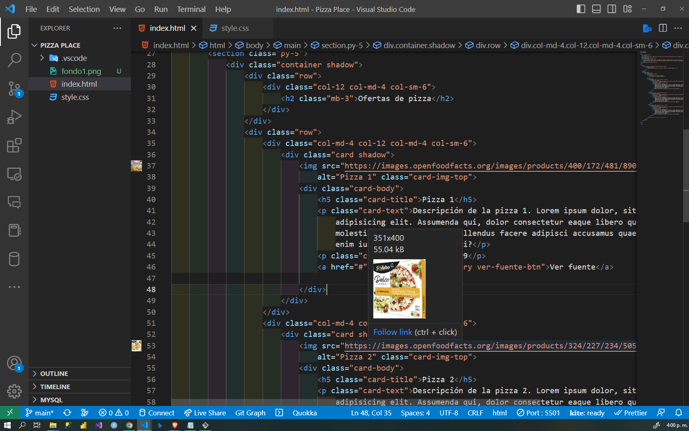
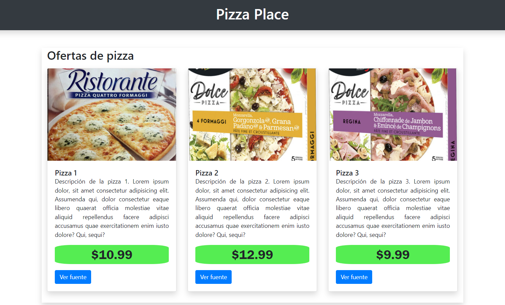

# Pizza-Place
Pizza Place HTML, CSS, BOOTSTRAP.

Este proyecto es una página web que muestra una lista de ofertas de pizzas de un lugar llamado "Pizza Place". La página utiliza HTML, CSS y Bootstrap para mostrar imágenes de las pizzas y descripciones de los productos en tarjetas. Cada tarjeta de producto incluye el nombre de la pizza, una breve descripción, un precio y un botón para ver la fuente. El proyecto también incluye un favicon personalizado.

## Captura de Pantalla:

## Captura de Pantalla:

